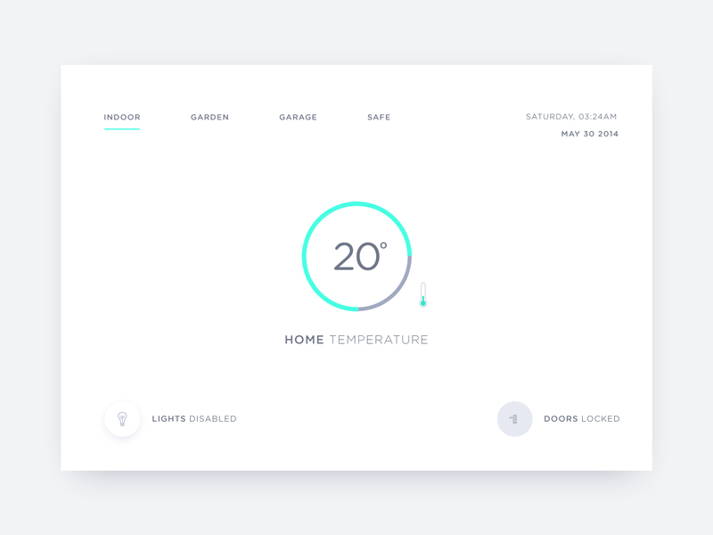

## Предизвикателство 1 - HTML и CSS 
Започваме с плавно въведение в света на HTML и CSS технологиите абсолютно задължителна основа за всички WEB разработчици. Предизвикателствата ще ви дадът поле за изява при експериментиране с тази материя.

## Инструменти
За да участвате в предизвикателството ви трябват следните инструменти
- [VS Code](https://code.visualstudio.com/) - Текстов редактор за изпълнение на JavaScript код

Като допълнителен инструмент в рамките на инициативата ще усвоите работа с:
- [GIT](https://git-scm.com/download/win)  Система за управление на версиите - GIT
- [Github for windows](https://desktop.github.com/) Система за менежиране на Git в контекста на GitHub

## Учебни материали и документация
- [HTML документация ](https://developer.mozilla.org/en-US/docs/Web/HTML) - Платформа за интерпретация и изпълнение на JavaScript код
- [CSS документация](https://developer.mozilla.org/en-US/docs/Web/CSS) - Текстов редактор за изпълнение на JavaScript код
- [Learn css](https://web.dev/learn/css/) - Интересна инструкция за разучаване на CSS правила

## Учебни материали и видео уроци - на англииски език
- [Обобщен курс за HTML](https://www.youtube.com/watch?v=qz0aGYrrlhU)
- [Подробен курс за HTML и CSS](https://www.youtube.com/watch?v=mU6anWqZJcc)

## Полезни YT канали с видео уроци 
- [Kevin Powell](https://www.youtube.com/kepowob)

## Упражнения 

Първото предизвикателство е да разработим и публикуваме набор от графични интерфейси, които да ни помогнат да навлезем по-навътре в HTML и CSS логиката. Интерфейсите са разпределени в няколко категории, спремо спекулативната им сложност.

### **Ниво на сложност - лесно**

Лесните графични интерфейси включват само няколко базови компоненти, трябва да съобразите:
- цветовата схема
- размера на шрифта и отстоянията
- графични детайли като заоблени ръбове и сенки

### **Ниво на сложност - средно**

При средно ниво интерфейси трябва да съобразите, следните аспекти:
- всички особености на лесните интерфейси
- layout и геометрия на отделните елементи (ляво дясно позициониране)
- по сложни цветови преливки

### **Ниво на сложност - трудно**

При сложно ниво на интерфейси трябва да разработите цялостни WEB саит с помоща на HTML и CSS.

